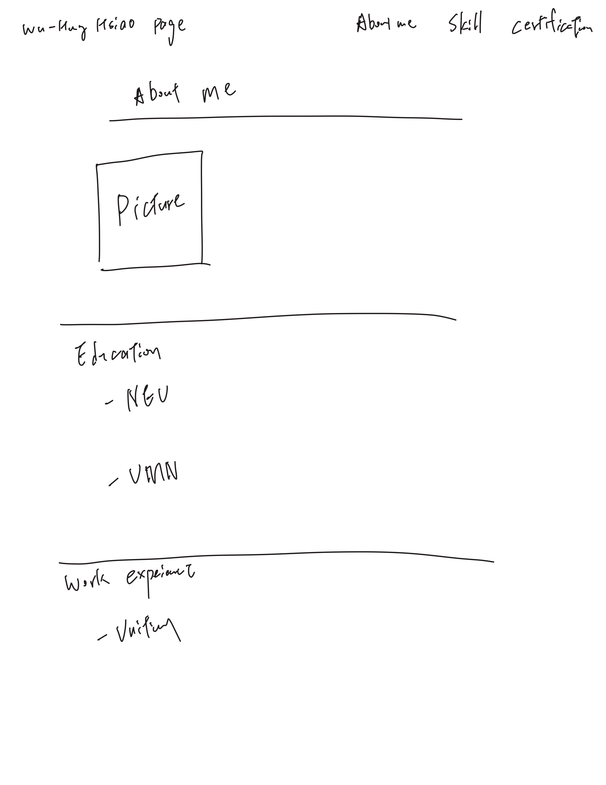
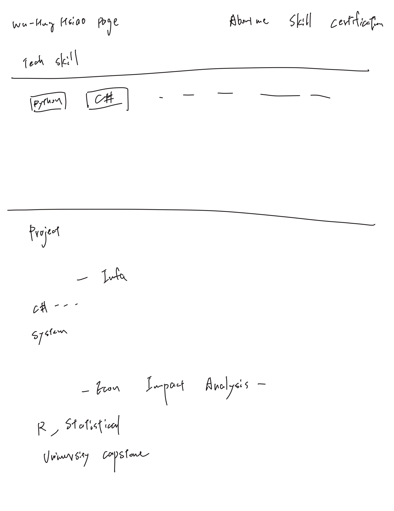
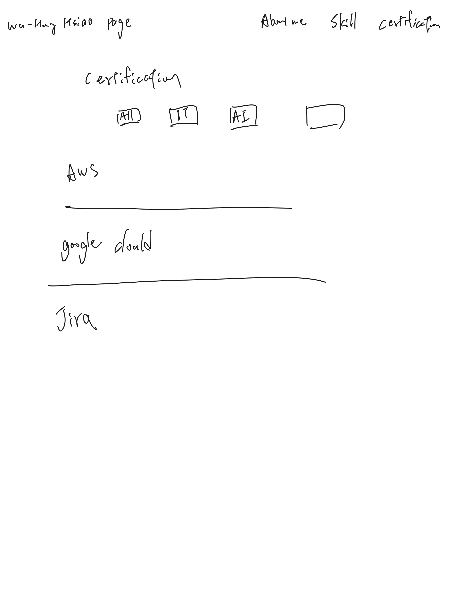

# Project 1: Design Document

## 1. Project Description
This project is a professional personal portfolio website. The main goal is to showcase my academic background, cloud certifications, and technical projects to industry recruiters and potential tech collaborators. The website is static, responsive, and front-end only, built using pure HTML5, CSS3, and ES6+ JavaScript. It consists of three main pages:
* **Home Page (About Me):** A professional landing page featuring my summary, education at Northeastern University, and my professional work experience.
* **Skills & Projects Page:** An organized portfolio section using a responsive grid layout to display my backend technical skills (C#, .NET, Redis, SQL) and detailed project cards.
* **Certifications Page:** An interactive page featuring a custom Filterable Certifications List. It uses vanilla JavaScript DOM manipulation to filter Cloud, AI & Data, and IT certifications dynamically.

## 2. User Personas
* **Persona 1: Technical Recruiter**
  * **Goal:** Wants to quickly verify the candidate's backend skills and see how they apply clean design principles to a live web portfolio within 30 seconds.
  * **Pain Point:** Hates reading flat, text-only PDF resumes and gets frustrated with portfolio sites that fail to layout correctly on mobile screens.
* **Persona 2: Technical Peer / Potential Collaborator**
  * **Goal:** Wants to find a reliable backend developer who has practical experience with systems engineering, modular architecture, and solid GitHub practices.
  * **Pain Point:** Finds it hard to evaluate classmates' true coding capabilities without seeing a live website or an accessible GitHub link.

## 3. User Stories
* **User Story 1 (For Technical Recruiter):** As a technical recruiter, I want to see a distinct, responsive navigation menu so that I can switch directly to the Skills and Projects grid within 10 seconds.
* **User Story 2 (For Technical Peer):** As a potential project partner, I want to see a clear, chronologically ordered list of experiences and projects so that I can quickly evaluate the candidate's background and technical depth.
* **User Story 3 (For General Visitor):** As a general visitor, I want a "Certifications" page with an interactive feature (Filterable List) so that I can easily sort through the candidate's professional development achievements.

## 4. Mockups
This section contains hand-drawn sketches (wireframes) for the three main pages, demonstrating the layout planning prior to development.

### Home Page (`index.html`)
* **Layout:** A clean hero section with a profile picture, name, and a brief professional summary. The navigation bar sits at the top (Bootstrap Navbar). Below the hero section, details on education and professional experience are displayed in structured blocks.
* **Image Reference:** 
  

### Skills & Projects Page (`skills.html`)
* **Layout:** Uses a responsive Grid System (Bootstrap 5). The top section lists technical skills (C#, .NET, Redis, SQL) in badges or cards. The bottom section displays project cards (e.g., Infa Backend Infrastructure, Statistical Modeling) arranged in a grid that collapses to a single column on mobile.
* **Image Reference:** 
  

### Certifications Page (`extra.html`)
* **Layout:** A clean, academic layout displaying various IT certifications. A group of filter buttons ("All", "Cloud & IT", "AI & Data") sits at the top, allowing users to dynamically filter the entries below.
* **Image Reference:** 
  