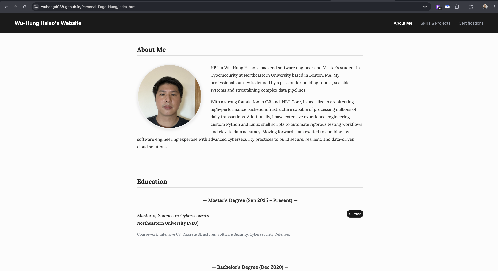

# Wu-Hung Hsiao - Personal Portfolio (Project 1)

**Author:** [Wu-Hung Hsiao](https://github.com/wuhong4088)  
**Class Link:** [CS 5610 Web Development](https://johnguerra.co/classes/webDevelopment_online_summer_2026/)

## Project Objective
In this assignment, we are implementing a personal homepage using vanilla HTML5, CSS3, and ES6+. This is a front-end only static site, avoiding backend frameworks and large UI component libraries (like React or Vue). All custom JavaScript is written in ES6 modules.

The project features a **creative addition**: A dynamic "Filterable Certifications List" on the *Certifications* page (`extra.html`), using vanilla JavaScript to filter Cloud, Data/AI, and Process certifications smoothly via DOM manipulation.

## Links (Submission Requirements)
* **Deployed URL (GitHub Pages)**: [https://wuhong4088.github.io/Personal-Page-Hung/](https://wuhong4088.github.io/Personal-Page-Hung/)
* **Presentation (Google Slides)**: [Google Slides Presentation](https://docs.google.com/presentation/d/1T7P345ChIF7ICOKhVh0haiuZC-nKZ28i2EZMVnt9QJc/edit)
* **Video Demonstration**: [YouTube Live Demo](https://youtu.be/NFlVazZFq1g)

## Screenshot


## Tech Requirements
* Vanilla HTML5 & CSS3
* Bootstrap 5 (Navbar & Grid Utilities)
* Custom CSS Layouts (Flexbox & CSS Grid)
* Relative & Absolute Positioning
* ES6+ JavaScript (Modules)

## Instructions to Build

```bash
# Clone the repository
git clone https://github.com/wuhong4088/Personal-Page-Hung.git

# Navigate into the project
cd Personal-Page-Hung

# Run local static server
npx serve .
```

After running the command, check your terminal for the local server URL (typically `http://localhost:3000`). Open that URL in your browser to view the site locally.

## Pages
| Page | URL | Description |
|------|-----|-------------|
| Home Page | `index.html` | Professional summary, education timeline, and work experience. |
| Skills & Projects | `skills.html` | Responsive grid showcasing tech stack and portfolio. |
| Certifications | `extra.html` | Interactive Vanilla JS Filterable List. |

## AI Tool Usage
**Describe the use of GenAI tools if any. Provide what models were used, versions, prompts, and how it was used.**

I used AI (Gemini 3.1 Pro via AntiGravity IDE) primarily to assist in developing the "Certifications" page (`extra.html`) and to structure this `README.md`. My workflow was as follows:

1. **Data Sourcing:** I downloaded my personal LinkedIn profile as a PDF document.
2. **Content Extraction & HTML Layout:** I provided the PDF to the AI and used the following prompt to generate the HTML structure for the certifications page (`extra.html`). After the HTML was generated, I manually wrote the custom Vanilla JavaScript (`js/activities.js`) from scratch to implement the dynamic filtering logic.

   **Prompt Used:**
   > *"Here is my LinkedIn profile exported as a PDF. Please extract my real certifications and professional achievements. Using this data, generate an HTML page (`extra.html`) with a clean, academic layout. Please organize the items into categories like Cloud, AI & Data, and Process so I can later write my own JavaScript to filter them."*

3. **README Generation:** I also provided the AI with the project requirements and used it to format and generate this `README.md` file.

   **Prompt Used:**
   > *"Please help me write a README.md for my personal portfolio website project. Please include the following exact sections: Project Objective, Links, Screenshot, Tech Requirements, Instructions to Build, AI Tool Usage, Video Demonstration, and License. The project is a personal portfolio homepage built with vanilla HTML5, CSS3, ES6+, Bootstrap 5, and custom CSS Layouts. Please use standard GitHub Markdown formatting."*

## License
MIT License
